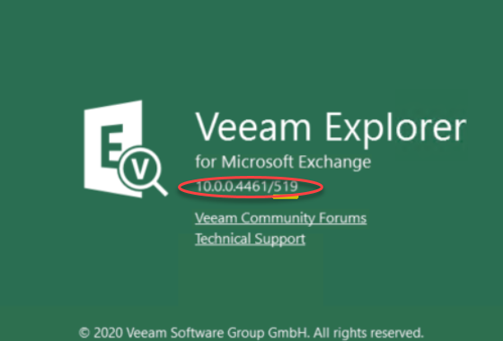

# Veeam Explorers

## Veeam Explorer Version Check

Ensure the versions you offer to tenents is at the same version revision as the Service Provider installed version and revision.

##  Explorer content

It is recommended that you download or supply to the tenent a copy of the Veeam Exporer Software installation files.

The extracted files will also contain the VBO application (there is no requirement for the tenent to use this) plus the following explorers for:

* Explorer for Exchange
* Explorer for Sharepoint
* Explorer for OneDrive

It is essential that these be at the same version number as the provisioned files in the Service Provider installation. if the versions differ there will be failures on restores the tenent attempts due to software inconsistancy.  

  

* The first number denotes the compatability with version 10.0.0.4451 of Veeam Backup and Replication
* The second number 519 denotes the version number of the installed VBO package

**Advise the tenent not to attempt to use the VBO application, it will avoid issues later**
