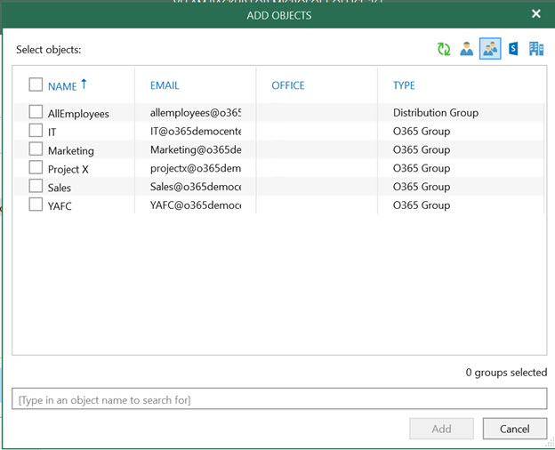
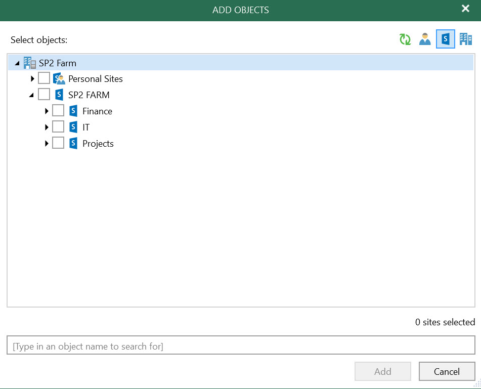

# Job Configuration 

In this section we will discuss job configuration, options to create the backup job as well as the best practice for the backup job configuration.
Veeam Backup for Microsoft Office 365 offers multiple options to create the backup job to protect the environment.

Backup job can be created based on following objects:

* Groups
* Users
* Sites
* Organizations.

Configuring a single backup job is appealing, but the maintenance of a single backup job is challenging because of the following potential risks:

* Single point of failure.
* Management.
* Backup duration.  
* Restore.

In this section, we will discuss the best practice about backing up the different workloads.
We have the following workloads protection in Veeam Backup for Microsoft Office 365:

* Microsoft Exchange
* Microsoft Sharepoint
* Microsoft OneDrive for Business

## Microsoft Exchange:

It’s recommended to create multiple jobs based on group if the environment is 500+ mailboxes, the backup job based on group object are easy to manage for backup and restore operations and provides the good performance.

**For example**
The jobs can be created based on the departments in the Organization, Veeam Backup for Microsoft Office 365 also provides you options to exclude the mailboxes from the backup job in event users left the organization you can easily exclude the mailbox from backup job processing as shown in the picture below.

## Microsoft Sharepoint:
Veeam Backup for Microsoft Office 365 provides you an option to protect the complete SharePoint farm, as a best practice in the single job you can add up to 50 SharePoint sites.
Similar to the Microsoft Exchange mailbox protection there is an option to select individual sites in the backup job as shown in the picture below:

 
